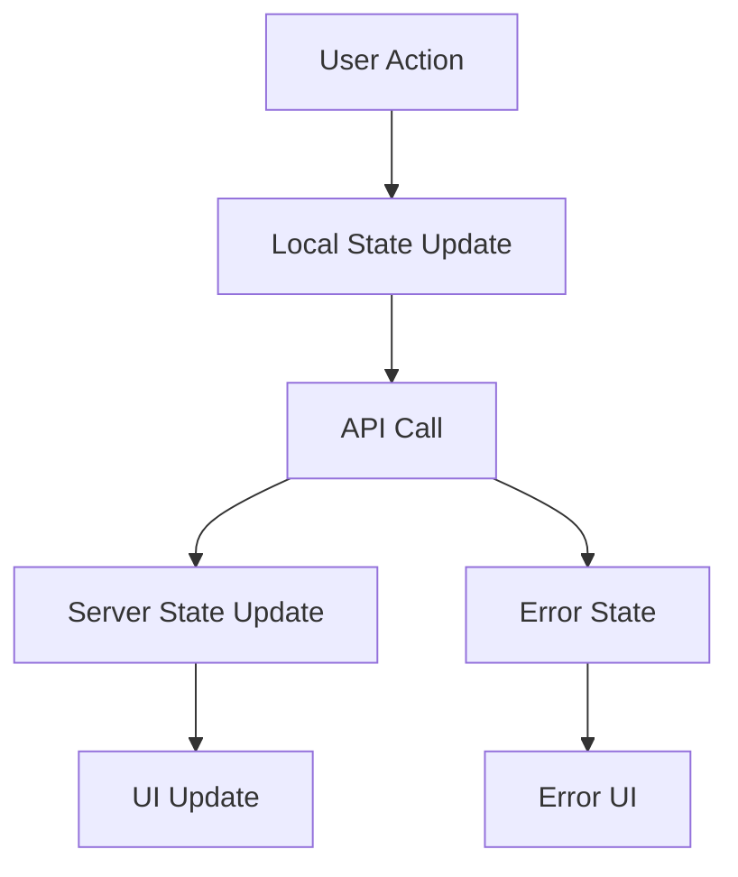

# Module Documentation Template

Use this template when creating documentation for new modules. Copy this template and customize it for your specific module.

## 📋 Module Information

**Module Name:** [Module Name]  
**Created Date:** [YYYY-MM-DD]  
**Last Updated:** [YYYY-MM-DD]  
**Version:** [1.0.0]  
**Author:** [Your Name]

## 🎯 Overview

### Purpose

Brief description of what this module does and why it exists.

### Key Features

- Feature 1
- Feature 2
- Feature 3

### Dependencies

- React Query
- Next.js 15
- TypeScript
- [Other dependencies]

## 🏗️ Architecture

### Component Structure

```
[module-name]/
├── components/
│   ├── [ComponentName].tsx
│   ├── [AnotherComponent].tsx
│   └── index.ts
├── hooks/
│   ├── use-[feature].ts
│   └── index.ts
├── types/
│   ├── [feature]-types.ts
│   └── index.ts
├── services/
│   ├── [feature]-service.ts
│   └── index.ts
├── utils/
│   ├── [feature]-utils.ts
│   └── index.ts
└── README.md
```

### Design Patterns Used

- [ ] SOLID Principles
- [ ] Container/Presentational Pattern
- [ ] Custom Hooks Pattern
- [ ] Composition Pattern
- [ ] Factory Pattern
- [ ] Observer Pattern

## 🎨 UI Components

### Components Created

| Component     | Purpose     | Props     | Variants           |
| ------------- | ----------- | --------- | ------------------ |
| ComponentName | Description | Interface | Variant1, Variant2 |

### Design System Compliance

- [ ] Uses existing UI components from `/components/ui/`
- [ ] Follows color system from `/lib/Colors.ts`
- [ ] Implements proper variants with class-variance-authority
- [ ] Responsive design implemented
- [ ] Accessibility (A11y) compliant

### Example Usage

```typescript
import { ComponentName } from '@/components/[module-name]'

<ComponentName
  title="Example Title"
  onAction={handleAction}
  variant="default"
  className="custom-class"
/>
```

## 🔄 State Management

### Local State

- **useState** for simple state
- **useReducer** for complex state logic
- **Custom hooks** for reusable state logic

### Server State

- **React Query** for API data
- **Optimistic updates** implemented
- **Error handling** with proper fallbacks
- **Loading states** managed

### State Flow Diagram



## 🌐 Internationalization

### Translation Keys Added

```json
{
  "[moduleName]": {
    "title": "Module Title",
    "description": "Module description",
    "actions": {
      "submit": "Submit",
      "cancel": "Cancel"
    },
    "messages": {
      "success": "Operation successful",
      "error": "Operation failed"
    }
  }
}
```

### Supported Languages

- [ ] English (en)
- [ ] German (de)
- [ ] [Other languages]

## 🔌 API Integration

### Endpoints Used

| Method | Endpoint            | Purpose     | Response Type |
| ------ | ------------------- | ----------- | ------------- |
| GET    | /api/[resource]     | Fetch data  | [Type]        |
| POST   | /api/[resource]     | Create data | [Type]        |
| PUT    | /api/[resource]/:id | Update data | [Type]        |
| DELETE | /api/[resource]/:id | Delete data | [Type]        |

### API Service Implementation

```typescript
// services/[feature]-service.ts
export const [feature]Service = {
  async getAll(): Promise<[Type][]> {
    return api.getAllData({ url: '/api/[resource]' })
  },

  async create(data: Create[Type]Data): Promise<[Type]> {
    return api.post({ url: '/api/[resource]', body: data })
  },

  // ... other methods
}
```

### React Query Hooks

```typescript
// hooks/use-[feature].ts
export const use[Feature] = () => {
  return useQuery({
    queryKey: ['[feature]'],
    queryFn: [feature]Service.getAll,
  })
}

export const useCreate[Feature] = () => {
  return useMutation({
    mutationFn: [feature]Service.create,
  })
}
```

## 📝 Forms

### Form Components Used

- [ ] BaseFormComponent
- [ ] Custom form fields
- [ ] Validation with Zod
- [ ] Error handling

### Form Schema

```typescript
const [feature]Schema = z.object({
  field1: z.string().min(2, 'Field 1 must be at least 2 characters'),
  field2: z.string().email('Invalid email address'),
  // ... other fields
})
```

### Form Fields Configuration

```typescript
const [feature]Fields: FieldDefinition[] = [
  {
    name: 'field1',
    label: 'field1',
    type: 'input',
    required: true,
    className: 'col-span-6',
  },
  // ... other fields
]
```

## 📊 Data Display

### Tables Used

- [ ] DataTable component
- [ ] Custom table components
- [ ] Sorting and filtering
- [ ] Pagination

### Column Definitions

```typescript
const columns: ColumnDef<[Type]>[] = [
  {
    accessorKey: 'field1',
    header: 'Field 1',
    cell: ({ row }) => <span>{row.original.field1}</span>
  },
  // ... other columns
]
```

## 🧪 Testing

### Test Coverage

- [ ] Unit tests for components
- [ ] Integration tests for API
- [ ] E2E tests for user flows
- [ ] Accessibility tests

### Test Files

```
__tests__/
├── components/
│   ├── [ComponentName].test.tsx
│   └── [AnotherComponent].test.tsx
├── hooks/
│   ├── use-[feature].test.ts
│   └── [another-hook].test.ts
└── integration/
    └── [feature]-flow.test.tsx
```

## 🚀 Performance

### Optimizations Implemented

- [ ] React.memo for expensive components
- [ ] useCallback for event handlers
- [ ] useMemo for expensive calculations
- [ ] Lazy loading for heavy components
- [ ] Code splitting

### Performance Metrics

- **Bundle Size:** [X]KB
- **First Contentful Paint:** [X]ms
- **Largest Contentful Paint:** [X]ms
- **Cumulative Layout Shift:** [X]

## 🔒 Security

### Security Measures

- [ ] Input validation with Zod
- [ ] XSS protection
- [ ] CSRF protection
- [ ] Proper authentication
- [ ] Data sanitization

### Security Checklist

- [ ] All inputs validated
- [ ] No sensitive data in client code
- [ ] Proper error handling
- [ ] Secure API calls
- [ ] Authentication checks

## 📱 Responsive Design

### Breakpoints

- **Mobile:** < 640px
- **Tablet:** 640px - 1024px
- **Desktop:** > 1024px

### Responsive Features

- [ ] Mobile-first design
- [ ] Touch-friendly interactions
- [ ] Responsive images
- [ ] Flexible layouts
- [ ] Adaptive typography

## ♿ Accessibility

### A11y Features

- [ ] Semantic HTML
- [ ] ARIA attributes
- [ ] Keyboard navigation
- [ ] Screen reader support
- [ ] Color contrast compliance
- [ ] Focus management

### Accessibility Checklist

- [ ] All interactive elements are keyboard accessible
- [ ] Proper heading hierarchy
- [ ] Alt text for images
- [ ] Form labels associated with inputs
- [ ] Error messages announced to screen readers

## 🔧 Configuration

### Environment Variables

```env
# Required
NEXT_PUBLIC_[FEATURE]_API_URL=https://api.example.com

# Optional
NEXT_PUBLIC_[FEATURE]_DEBUG=true
NEXT_PUBLIC_[FEATURE]_CACHE_TTL=300000
```

### Configuration Options

```typescript
interface [Feature]Config {
  apiUrl: string
  debug: boolean
  cacheTtl: number
  // ... other options
}
```

## 🚀 Deployment

### Build Requirements

- Node.js 18+
- Next.js 15
- TypeScript 5+

### Deployment Steps

1. Install dependencies: `npm install`
2. Build project: `npm run build`
3. Start production: `npm start`

### Environment Setup

```bash
# Development
npm run dev

# Production build
npm run build
npm start

# Type checking
npm run type-check

# Linting
npm run lint
```

## 📚 Usage Examples

### Basic Usage

```typescript
import { [Feature]Provider, use[Feature] } from '@/components/[module-name]'

function App() {
  return (
    <[Feature]Provider>
      <[Feature]Component />
    </[Feature]Provider>
  )
}
```

### Advanced Usage

```typescript
const { data, isLoading, error } = use[Feature]({
  filters: { status: 'active' },
  pagination: { page: 1, limit: 10 }
})

if (isLoading) return <LoadingSpinner />
if (error) return <ErrorMessage error={error} />

return <[Feature]List data={data} />
```

## 🐛 Troubleshooting

### Common Issues

#### Issue 1: [Description]

**Problem:** [What goes wrong]  
**Solution:** [How to fix it]  
**Prevention:** [How to avoid it]

#### Issue 2: [Description]

**Problem:** [What goes wrong]  
**Solution:** [How to fix it]  
**Prevention:** [How to avoid it]

### Debug Mode

```typescript
// Enable debug mode
const [feature]Config = {
  debug: true,
  // ... other config
}
```

## 🔄 Changelog

### Version 1.0.0 (YYYY-MM-DD)

- Initial release
- Basic functionality implemented
- Documentation created

### Version 1.1.0 (YYYY-MM-DD)

- Added new feature
- Fixed bug
- Performance improvements

## 🤝 Contributing

### Development Setup

1. Fork the repository
2. Create feature branch: `git checkout -b feature/[feature-name]`
3. Make changes following the coding standards
4. Add tests for new functionality
5. Update documentation
6. Submit pull request

### Code Review Checklist

- [ ] Follows SOLID principles
- [ ] Uses existing UI components
- [ ] Implements proper TypeScript types
- [ ] Uses React Query for server state
- [ ] Implements proper error handling
- [ ] Uses translations for all text
- [ ] Follows component structure guidelines
- [ ] Includes proper documentation
- [ ] Tests pass successfully

## 📞 Support

### Getting Help

- Check existing documentation
- Review component examples
- Ask team members
- Create issue on GitHub

### Resources

- [Design System Documentation](./DESIGN_SYSTEM.md)
- [API Documentation](./API_DOCUMENTATION.md)
- [Component Library](./COMPONENT_LIBRARY.md)

---

**Last Updated:** [YYYY-MM-DD]  
**Next Review:** [YYYY-MM-DD]  
**Maintainer:** [Your Name]
